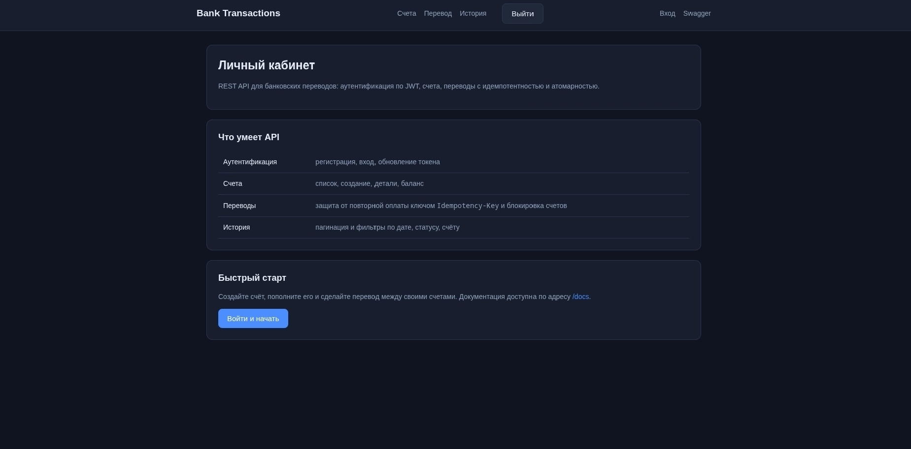
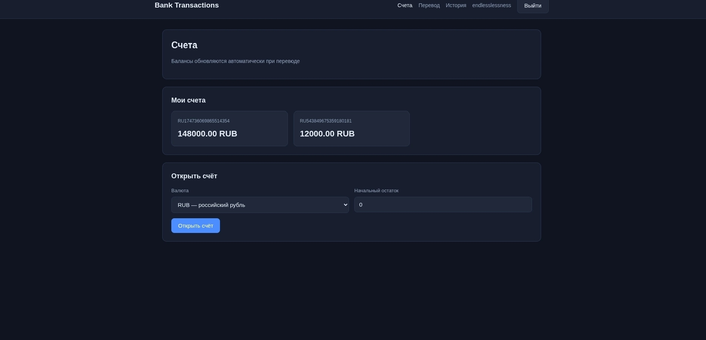
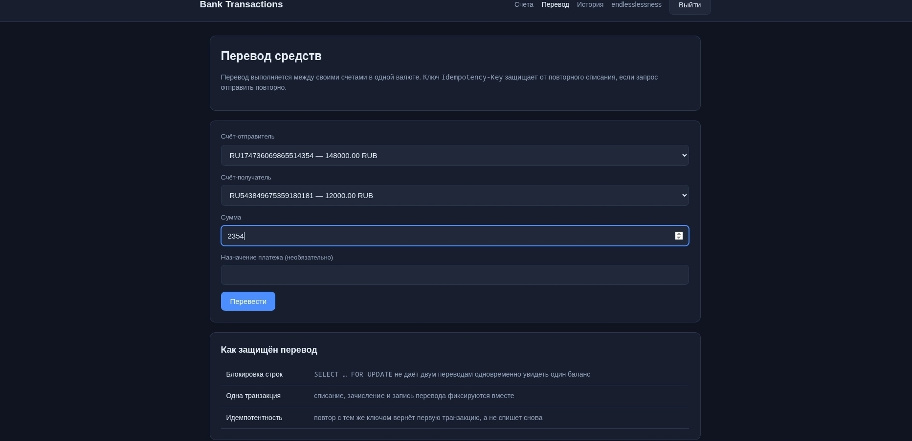
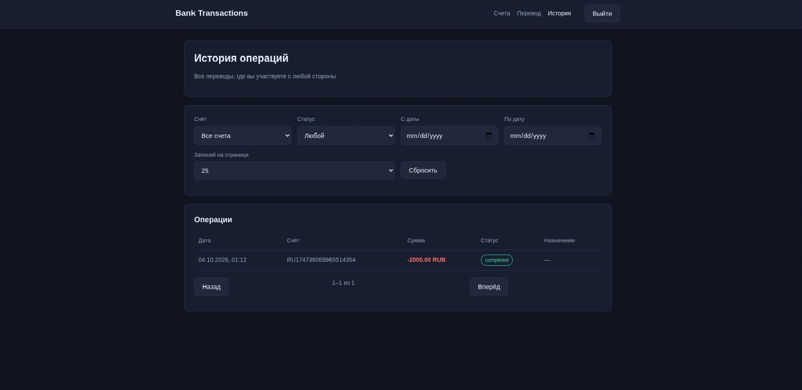

# Bank Transactions API

REST API для банковских транзакций: аутентификация по JWT, счета, переводы
с идемпотентностью и атомарностью.

## Стек

- Python 3.11, FastAPI, Uvicorn
- SQLAlchemy 2.0 (async), Alembic, asyncpg
- PostgreSQL 16, Redis 7
- Pydantic v2, pydantic-settings
- python-jose (JWT), passlib[bcrypt], slowapi (rate limiting)
- pytest, httpx, ruff, mypy
- Docker, Docker Compose, Nginx

## Структура

```
bank-transactions-api/
├── backend/
│   ├── app/
│   │   ├── api/
│   │   │   ├── deps.py          # разбор токена, пагинация
│   │   │   └── v1/
│   │   │       ├── endpoints/   # HTTP-эндпоинты (тонкие)
│   │   │       └── router.py
│   │   ├── core/               # конфиг, безопасность, Redis, лимиты
│   │   ├── db/                 # подключение и сессии
│   │   ├── models/             # SQLAlchemy-модели
│   │   ├── schemas/            # Pydantic-схемы
│   │   ├── services/           # бизнес-логика и доменные исключения
│   │   └── main.py             # точка входа
│   ├── alembic/                # миграции
│   ├── tests/                  # тесты
│   ├── Dockerfile
│   ├── requirements.txt
│   ├── pyproject.toml          # ruff, mypy, pytest
│   └── .env.example
├── frontend/                   # статика, отдаётся nginx
│   ├── index.html              # главная
│   ├── login.html              # вход и регистрация
│   ├── accounts.html           # счета
│   ├── transfer.html           # перевод
│   ├── history.html            # история операций
│   ├── js/api.js               # клиент API
│   └── css/style.css
├── nginx/
│   └── nginx.conf
├── docker-compose.yml
└── README.md
```

## Запуск

```bash
cp backend/.env.example backend/.env
docker compose up --build -d
```

- Фронтенд и прокси: http://localhost
- API напрямую: http://localhost:8000
- Swagger: http://localhost:8000/docs
- ReDoc: http://localhost:8000/redoc

Порты не взаимозаменяемы: на `8000` живёт только API, интерфейса там
нет и не планируется — за него отвечает nginx. Если открыть
`http://localhost:8000/`, придёт JSON со ссылками на разделы сервиса,
а сам сайт нужно открывать на `http://localhost` (например,
`/login.html`).

Логи: `docker compose logs -f backend`

## Локальная разработка

```bash
python -m venv .venv && source .venv/bin/activate
pip install -r backend/requirements.txt
cd backend && uvicorn app.main:app --reload
```

Линтер и типизация:

```bash
ruff check backend
mypy backend/app
```

Тесты:

```bash
# отдельная база для тестов, чтобы не затрагивать данные разработки
docker compose exec db psql -U bank -d bank -c "CREATE DATABASE bank_test;"
pytest backend/tests
```

Тесты работают с базой `bank_test` и базой Redis `1`: адреса задаются
переменными окружения в `backend/tests/conftest.py`. Перед каждым
тестом таблицы очищаются, поэтому тесты не зависят от порядка
запуска.

## API

### Auth

| Метод | Путь                        | Описание                  |
| ----- | --------------------------- | ------------------------- |
| POST  | `/api/v1/auth/register`     | Регистрация               |
| POST  | `/api/v1/auth/login`        | Логин, выдача JWT         |
| POST  | `/api/v1/auth/refresh`      | Обновить токен            |
| GET   | `/api/v1/auth/me`           | Текущий пользователь      |

### Accounts

| Метод | Путь                              | Описание       |
| ----- | --------------------------------- | -------------- |
| GET   | `/api/v1/accounts`                | Список счетов  |
| POST  | `/api/v1/accounts`                | Создать счёт   |
| GET   | `/api/v1/accounts/{id}`           | Детали счёта   |
| GET   | `/api/v1/accounts/{id}/balance`   | Баланс счёта   |

### Transactions

| Метод | Путь                          | Описание                       |
| ----- | ----------------------------- | ------------------------------ |
| POST  | `/api/v1/transactions`        | Создать перевод                 |
| GET   | `/api/v1/transactions`        | История транзакций              |
| GET   | `/api/v1/transactions/{id}`   | Детали транзакции               |

Параметры `GET /api/v1/transactions`: `page`, `size`, `account_id`,
`status`, `date_from`, `date_to`.

Заголовок `Idempotency-Key` обязателен для `POST /api/v1/transactions`:
повторный запрос с тем же ключом вернёт уже созданную транзакцию с
кодом 200 вместо 201 и не спишет средства дважды.

## Как это работает

**Атомарность перевода.** Счета блокируются через `SELECT … FOR UPDATE`,
списание, зачисление и запись транзакции фиксируются одной транзакцией
базы. Счета блокируются по возрастанию `id`, поэтому встречные переводы
не встанут в тупик друг другу.

**Идемпотентность.** Ключ из заголовка ищется в базе (уникальное
ограничение) и кэшируется в Redis на сутки. Если Redis недоступен,
перевод всё равно пройдёт: уникальность в базе остаётся последним
рубежом.

**Деньги считаются в `Decimal`.** Суммы хранятся в `Numeric(18, 2)`;
использование `float` дало бы накопление ошибки округления.

**Разделение слоёв.** `models` — таблицы, `schemas` — контракты API,
`services` — бизнес-логика и доменные исключения, `api/endpoints` —
тонкие HTTP-обёртки, `core` — конфигурация, безопасность, Redis.

**Приватность.** Чужой счёт или чужая транзакция отдают 404, а не 403:
иначе по коду ответа можно было бы перебирать существующие объекты.


### Что можно улучшить

- Refresh-токены не хранятся, поэтому отозвать их до истечения срока
  нельзя. Нужен `jti` и хранилище выданных токенов.
- Переводы разрешены только между своими счетами: пополнение чужого
  счёта по номеру не поддерживается.
- Нет вебхуков и фоновых задач: статус `pending` используется только
  как заготовка под асинхронную обработку.

### Скриншоты





